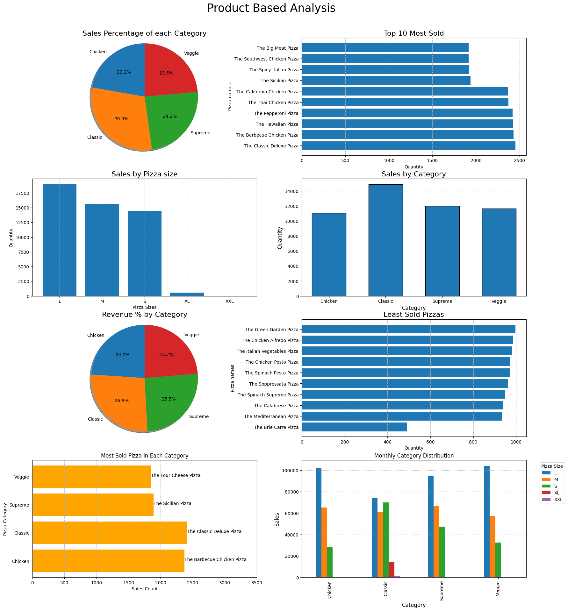

# 🍕 Pizza Sales Data Analysis

This project explores a comprehensive pizza sales dataset to uncover patterns, trends, and business insights using Python. It demonstrates practical data analysis techniques including cleaning, transformation, visualization, and interpretation.

## 📌 Objectives
- Explore dataset structure and dimensions
- Clean and preprocess data (nulls, duplicates, formatting)
- Perform time-based and product-based analysis
- Visualize trends using Matplotlib and Seaborn
- Derive actionable insights for business decisions

## 📊 Tools & Libraries
- Python (Pandas, NumPy)
- Matplotlib, Seaborn
- Jupyter Notebook

## 📁 Dataset Overview
- 48,620 records of pizza orders
- Columns include: `order_date`, `order_time`, `pizza_name`, `pizza_category`, `pizza_size`, `quantity`, `total_price`, etc.

## 🔍 Key Insights
- **Peak Sales Month**: July
- **Peak Sales Hour**: 12–1 PM and 5–6 PM
- **Top-Selling Category**: Classic pizzas (30% of total sales)
- **Most Sold Pizza**: The Classic Deluxe Pizza
- **Least Sold Pizza**: The Brie Carre Pizza
- **Preferred Size**: Large (L) pizzas
- **Highest Revenue Day**: Friday

## 📈 Visualizations
- Monthly and hourly sales trends
- Category-wise distribution across months and weekdays
- Revenue breakdown by day and category
- Top 10 and least sold pizzas
- Size preference and revenue comparison

## 📸 Dashboard Preview

---

## 📬 Contact

Feel free to connect or reach out if you're working on urban mobility, data visualization, or Python analytics!

**LinkedIn:** [[loganathanr1210](https://www.linkedin.com/in/loganathanr1210)]  
**GitHub:** [[LoganathanR03](https://github.com/LoganathanR03/)]

